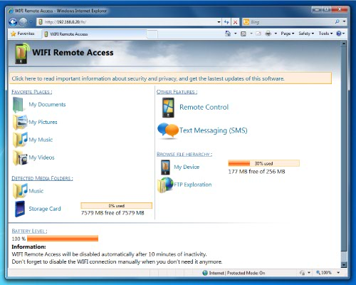

	
***Code samples reside here on GitHub. Get in Touch to order your personalized tool***
### Telegram: @Hack2Gain
 
---

## Features

- **.NET**
    - Coded in Visual Basic .NET, Client required framework 2.0 or 4.0 dependency, And server is 4.0
- **Plugin**
    - Using plugin system to decrease stub's size and lower the AV detection
- **Encryption**
    - The communication between server & client is encrypted with AES
- **Spreading**
    - Access all files and folders on USB drivers
- **Bypass**
    - Very low AV detection and undetected startup method
- **Lightweight**
    - Payload size is about 25 KB
- **Anti Virtual Machines**
    - Uninstall itself if the machine is virtual to avoid scanning or analyzing 
    - Access Cryptocurrency sensitive data
- **Screen-Locker**
    - Prevents user from accessing their Windows GUI  
 - **And more**
    - On Connect Auto Task
	- Force enable Windows RDP
	- Persistent or none
    - File manager
    - Passowrds stealer
    - Remote desktop
    - Bitcoin grabber
    - Downloader
    - **Keylogger**

---

This lightweight Windows-Linux RAT gives you full access to all Windows OS and Debian Linux distros. It remains undetectable to anti-virus as it is custom built and made to order. This eliminates the average person grabbing it from Github for free and using it, which would make it widely used by enthusiasts and researchers, and eventually known to the web security community.

_This tool in regulalry maintained to keep up with security patches and OS updates_

## This application is maintained and consistently beats all anti-virus software!

---------------------------------------------------------------
##### This software is for permitted remote access to an Andriod device and should not be used illegally.
###### Telegram @Hack2Gain

